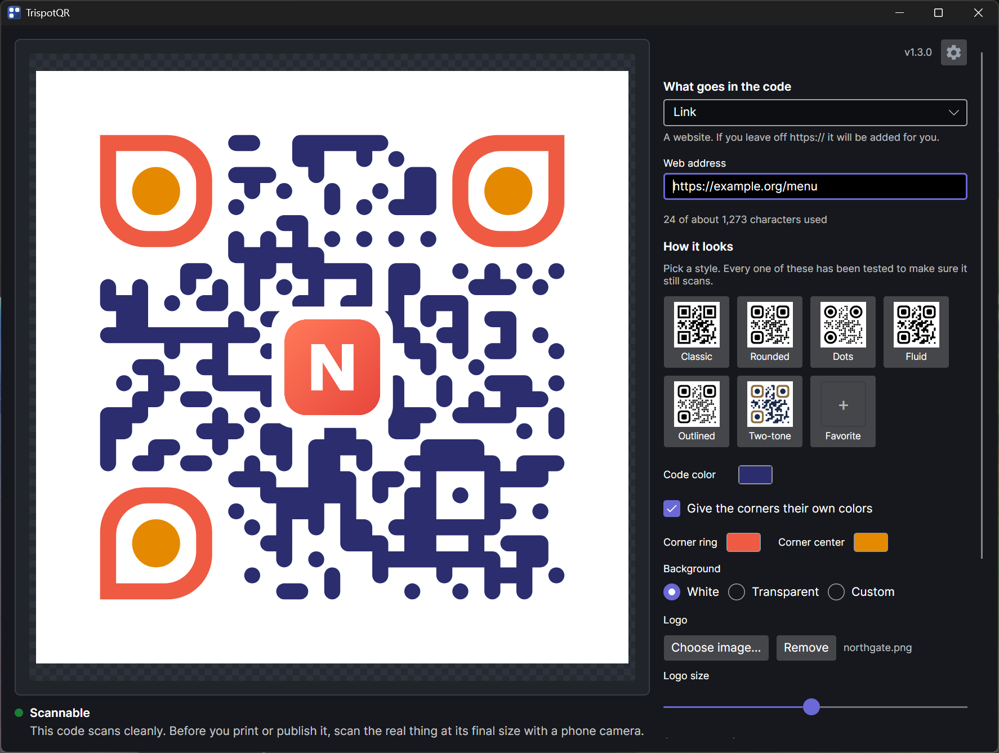
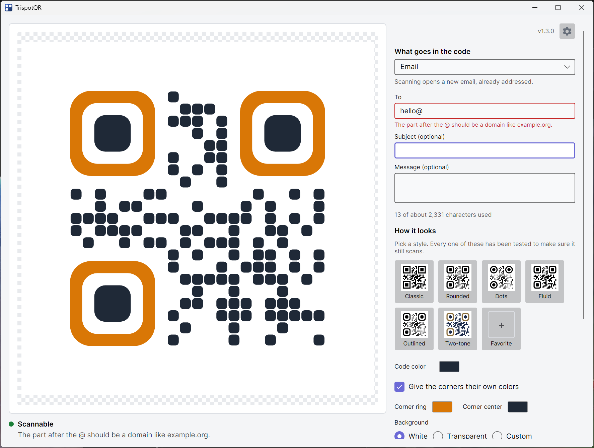
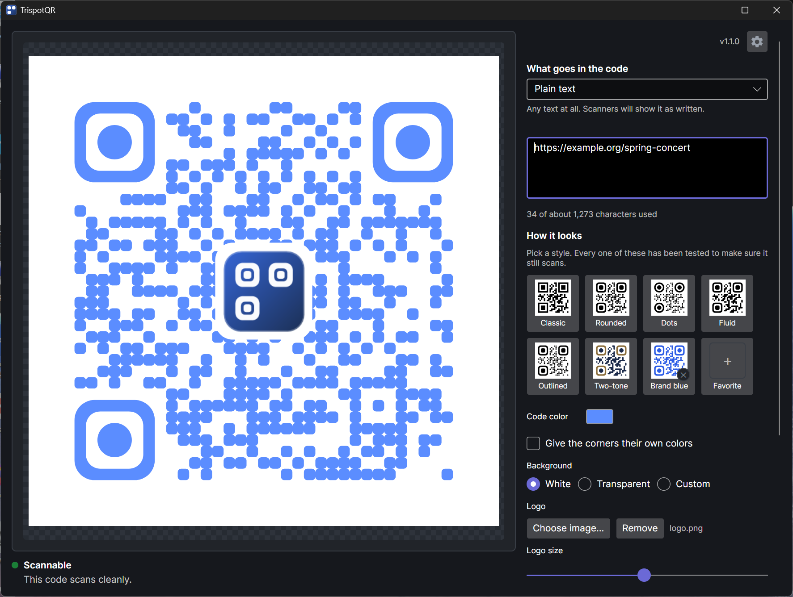
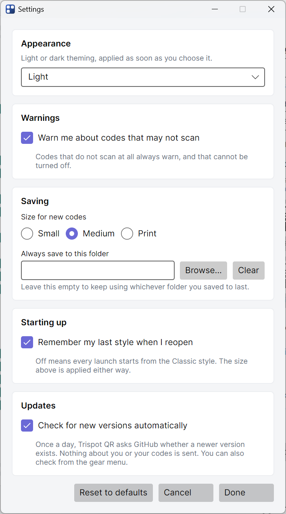

# Trispot QR

**Make a QR code, style it, and know it scans before you print it.**

A standalone Windows app that generates QR codes entirely on your own machine. Nothing is
uploaded, nothing is tracked, and nothing is installed.

[](https://github.com/levinium/TrispotQR/releases/latest)
[](https://github.com/levinium/TrispotQR/releases)

[](https://github.com/levinium/TrispotQR/actions/workflows/ci.yml)



## Download

**[Download TrispotQR-v1.0.0-win-x64.zip](https://github.com/levinium/TrispotQR/releases/download/v1.0.0/TrispotQR-v1.0.0-win-x64.zip)** (65 MB)

Unzip it anywhere and run `TrispotQR.exe`. That is the whole installation. There is no setup
step, no admin prompt and no registry entry, because the .NET runtime it needs is inside the
file. Delete it and it is gone. You need 64-bit Windows and nothing else.

If your machine already has the .NET 10 Desktop Runtime, the
[framework-dependent build](https://github.com/levinium/TrispotQR/releases/latest) is 6 MB
instead. Take the big one unless you know you want that.

### Mac and Linux

A cross-platform build is in progress. The Windows download above is the one to use today;
Mac and Linux builds arrive once the port reaches feature parity.

## Why not just use a website?

Online generators see whatever you type, and many of them quietly turn your code into a
redirect through their own servers. That redirect is a link you do not control: it can be
counted, changed, or switched off, and the day the site disappears every code you printed
stops working. Trispot QR encodes the value you typed, locally, and hands you the file.

## What it does

### It checks the code, rather than assuming

This is the part most generators skip. After every change the app renders the code and reads
it back with a real barcode decoder, then tells you what it found.

Low contrast, an inverted palette, a missing quiet zone and an oversized logo are all flagged
even when the decode succeeds, because those are the codes that read fine on a monitor and
then fail on printed paper. If a style genuinely will not scan, saving asks you to confirm
first.

That check is also why the style options are safe to use. A diamond-shaped corner marker was
built, tested against the decoder, and found to break the 1:1:3:1:1 ratio scanners rely on to
locate a code. It was removed rather than shipped.

### It builds the payload phones actually expect

Pick a type and fill in the fields. Plain text, Link, Wi-Fi, Email, Phone, Text message, or
Contact card. Each one produces the exact format a phone recognises, including the escaping
rules that are easy to get wrong by hand.

Every field is checked as you type, and the box at fault is the one that turns red.



The Link type adds `https://` when you leave it off, which is the single most common way a QR
code ends up scanning perfectly and doing nothing.

### It has real styling

Six built-in looks, and full control underneath: the shape of the dots, the shape of the
corner rings and their centres, the gap between dots, outlines, separate colours for the
corner markers, error correction level, margin size, and a logo in the middle.

### It saves in the formats you need

PNG at three sizes or a custom one, with a genuinely transparent background if you want one.
SVG for print, which stays sharp at any size. Or straight to the clipboard, ready to paste
into Word, PowerPoint or an email.

### It follows your theme

Light and dark, following Windows by default.



Settings cover appearance, warnings, where files are saved, the size new codes start at, and
whether your last style comes back when you reopen.



## Before you print

The app's decoder is strict, but it is not a phone camera. Scan the saved file with an actual
phone before a code goes to print. That is the only test that fully counts.

## Building from source

Needs the .NET 10 SDK.

```powershell
dotnet test          # 694 tests: 474 run on Windows, Linux and macOS
.\publish.ps1        # builds dist\TrispotQR.exe
```

`publish.ps1` runs the tests first and refuses to publish if any fail.

## How it is put together

```
src\TrispotQR.Core\        encoding, styling, geometry, export, scannability checking
src\TrispotQR.ViewModels\  presentation logic, shared across UI toolkits
src\TrispotQR.App\         the WPF window and views
tests\                     three test projects; two run on Windows, Linux and macOS
tools\                     one-off build utilities (the app icon generator)
```

### The design that matters

Everything is drawn once into Core's own platform-neutral geometry model (`QrPath`), measured
in **module units**, one unit per QR module. That single description then feeds the on-screen
preview, the Skia rasteriser, and the SVG writer. There is no second renderer to drift out of
sync, which is why the SVG and the PNG always match what the preview showed.

`TrispotQR.Core` targets plain `net10.0` and rasterises with SkiaSharp, so it carries no
Windows dependency. A test asserts that, because one convenient `using System.Windows.Media`
would undo it silently on a Windows machine. macOS and Linux versions are the reason.

### Why the test suite is shaped the way it is

The scannability matrix in `StyleMatrixScanTests` renders every combination the UI can produce
and decodes it back. It is not a formality. It is what caught the diamond corner marker
described above. Run this matrix before believing any change to the renderer is safe.

`MainWindowSmokeTests` lays out the real window offscreen and fails on WPF data binding
errors, which are otherwise invisible: a mistyped binding path shows an empty control and
writes a line to a trace listener nobody reads.

`ContrastTests` walks every window in both themes and fails any text that falls below a
readable contrast ratio, after a set of radio buttons once shipped as black on a dark
background.

### Where settings live

`%APPDATA%\TrispotQR\` on Windows holds `presets.json` (saved styles) and `settings.json`
(last used style and window size). The location resolves per platform
(`~/Library/Application Support/TrispotQR` on macOS, `$XDG_CONFIG_HOME/TrispotQR` or
`~/.config/TrispotQR` on Linux), though only the Windows app ships today. A file that will not
parse is moved aside and the app starts on the built-in styles rather than refusing to open.

## Third-party components

| Package | Licence | Used for |
| --- | --- | --- |
| Net.Codecrete.QrCodeGenerator | MIT | QR encoding |
| ZXing.Net | Apache 2.0 | decoding, for the scannability check |
| SkiaSharp | MIT | rasterising, so the renderer is not tied to Windows |
